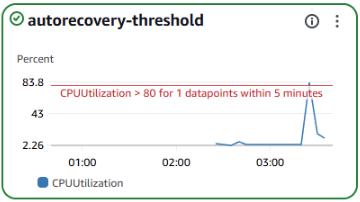
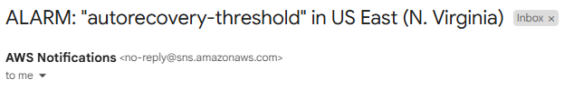

# Auto-Healing EC2 Website with AWS CloudWatch & SNS

## 📌 Objective
Deploy a self-healing web server that automatically recovers from failures using CloudWatch alarms and SNS notifications.

## 🛠️ Technologies Used
- **AWS Services**: EC2, CloudWatch, SNS, Lambda (optional)
- **Tools**: AWS CLI

## 📋 Steps
1. Launched EC2 instance with User Data to install Apache.
2. Configured CloudWatch alarm for high CPU.
3. Set up SNS to email/Slack alerts.
4. Tested auto-recovery by simulating CPU stress.

## 🎯 Key Features
- **Automated Recovery**: EC2 reboots if CPU >80% for 5 minutes.
- **Notification**: Alerts via email.


## 📸 Screenshots
| Description | Image |
|-------------|-------|
| CloudWatch CPU Alarm |  |
| SNS Email Alert |  |

## 🚀 How to Deploy
```bash
# Clone repo
git clone https://github.com/trucle9100/AWS-autohealing-project.git
